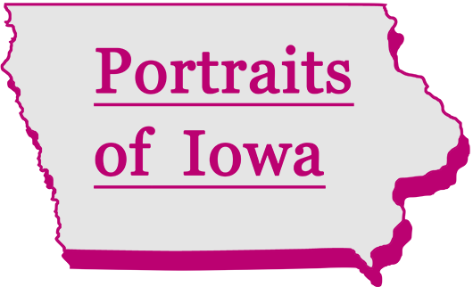

<!-- PROJECT LOGO -->
 

  

  <h3 align="center">Portraits of Iowa</h3>

  

    Website where residents of Cedar Rapids, Iowa could submit photos for the Portraits of Iowa public art installation.
     
     
        <a href="https://portraits-of-iowa.netlify.app/">Portraits of Iowa demo (Netlify)</a>
    ·
    <a href="https://www.linkedin.com/in/andrew-j-fleming-web-dev">My LinkedIn</a>

<!-- TABLE OF CONTENTS -->

  
Table of Contents

  <ol>
    <li>
      <a href="#about-the-project">About The Project</a>
      <ul>
        <li><a href="#built-with">Built With</a></li>
      </ul>
    </li>
    <li><a href="#contact">Contact</a></li>
  </ol>

<!-- ABOUT THE PROJECT -->

## About The Project

Public artist John Fleming commissioned a website for Portraits of Iowa, the winning project in a Cedar Rapids, Iowa, art installation competition. My client’s installation involved gathering hundreds of photo submissions from Cedar Rapids residents that would then be assembled into a hanging gallery/sculpture.

_A demo version of <a href="https://portraits-of-iowa.netlify.app/">Portraits of Iowa</a> is hosted on Netlify._

### Built With

- [React.js](https://reactjs.org/)
- [Bootstrap](https://getbootstrap.com)
- [Firebase](https://firebase.google.com/)

<!-- CONTACT -->

## Contact

Andrew Fleming - [My LinkedIn](https://www.linkedin.com/in/andrew-j-fleming-web-dev) - aflemi1@gmail.com

(<a href="#top">back to top</a>)

